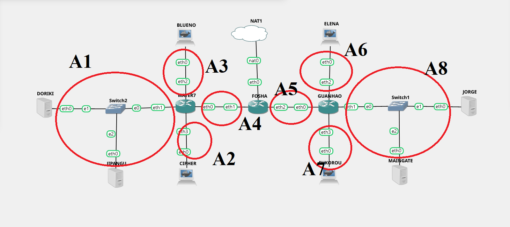

# Jarkom-Modul-5-T14-2021

Anggota Kelompok :
- Dida Prasetyo Rahmat - 05311940000019 
- Revina Rahmanisa Harjanto - 05311940000046 

--- 

## Soal A

Membuat topologi jaringan sesuai dengan rancangan yang diberikan Luffy dibawah ini:


```
Keterangan :  
Doriki adalah DNS Server
Jipangu adalah DHCP Server
Maingate dan Jorge adalah Web Server
Jumlah Host pada Blueno adalah 100 host
Jumlah Host pada Cipher adalah 700 host
Jumlah Host pada Elena adalah 300 host
Jumlah Host pada Fukurou adalah 200 host
```

## Soal B
Luffy ingin meminta kalian untuk membuat topologi tersebut menggunakan teknik CIDR atau VLSM. setelah melakukan subnetting,

  


## Soal C
Melakukan Routing agar setiap perangkat pada jaringan tersebut dapat terhubung.

## Soal D
Selanjutnya memberikan ip pada subnet Blueno, Cipher, Fukurou, dan Elena secara dinamis menggunakan bantuan DHCP server. Kemudian setting DHCP Relay pada router yang menghubungkannya.


### Setting DHCP-Relay
Melakukan instalasi isc-dhcp-relay dan lakukan config pada `/etc/default/isc-dhcp-relay` pada Foosha, Water7 dan Guanhao:
- Foosha
```
SERVERS="192.218.7.131"
INTERFACES="eth2 eth1"
OPTIONS=""
```
- Water 7
```
SERVERS="192.218.7.131"
INTERFACES="eth2 eth3 eth0 eth1"
OPTIONS=""
```
- Guanhao
```
SERVERS="192.218.7.131"
INTERFACES="eth2 eth3 eth1 eth0"
OPTIONS=""
```
lalu lakukan restart service isc-dhcp-relay pada kedua node tersebut

### Setting DHCP-Server
Melakukan instalasi isc-dhcp-server pada Jinpangu dan edit file `/etc/default/isc-dhcp-server`
```
INTERFACES="eth0
```
lalu pada file `/etc/dhcp/dhcp.conf` ditambahkan configurasi sebagai berikut dan restart servicenya
```
ddns-update-style none;
option domain-name "example.org";
option domain-name-servers ns1.example.org, ns2.example.org;
default-lease-time 600;
max-lease-time 7200;
log-facility local7;
subnet 192.218.0.0 netmask 255.255.252.0 {
    range 192.218.0.2 192.218.3.254;
    option routers 192.218.0.1;
    option broadcast-address 192.218.3.255;
    option domain-name-servers 192.218.7.130;
    default-lease-time 360;
    max-lease-time 7200;
}
subnet 192.218.7.0 netmask 255.255.255.128 {
    range 192.218.7.2 192.218.7.126;
    option routers 192.218.7.1;
    option broadcast-address 192.218.7.127;
    option domain-name-servers 192.218.7.130;
    default-lease-time 720;
    max-lease-time 7200;
}
subnet 192.218.4.0 netmask 255.255.254.0 {
    range 192.218.4.2 192.218.5.254;
    option routers 192.218.4.1;
    option broadcast-address 192.218.5.255;
    option domain-name-servers 192.218.7.130;
    default-lease-time 720;
    max-lease-time 7200;
}
subnet 192.218.6.0 netmask 255.255.255.0 {
    range 192.218.6.2 192.218.6.254;
    option routers 192.218.6.1;
    option broadcast-address 192.218.6.255;
    option domain-name-servers 192.218.7.130;
    default-lease-time 720;
    max-lease-time 7200;
}
subnet 192.218.7.128 netmask 255.255.255.248 {}
subnet 192.218.7.144 netmask 255.255.255.252 {}
subnet 192.218.7.148 netmask 255.255.255.252 {}
subnet 192.218.7.136 netmask 255.255.255.248 {}
```

## No. 1
Agar topologi yang kalian buat dapat mengakses keluar, kalian diminta untuk mengkonfigurasi Foosha menggunakan iptables, tetapi Luffy tidak ingin menggunakan MASQUERADE.

- Pada Foosha jalankan command berikut
```
iptables -t nat -A POSTROUTING -o eth0 -j SNAT --to-source "$IPETH0" -s 192.218.0.0/21
```

- hasil ping pada Fukorou


## No. 2
Kalian diminta untuk mendrop semua akses HTTP dari luar Topologi kalian pada server yang merupakan DHCP Server dan DNS Server demi menjaga keamanan.

- Pada Foosha
```
iptables -A FORWARD -d 192.218.7.131 -i eth0 -p tcp --dport 80 -j DROP
iptables -A FORWARD -d 192.218.7.130 -i eth0 -p tcp --dport 80 -j DROP
```

- Pada Jipangu dan Doriki
Lakukan instalasi netcat dengan command `apt-get install netcat`

- Pada Elena
dilakukan pengujian dengan command
```
nmap -p 80 192.218.7.131
nmap -p 80 192.218.7.130
```

- Hasil Pengujian


## No. 3
Karena kelompok kalian maksimal terdiri dari 3 orang. Luffy meminta kalian untuk membatasi DHCP dan DNS Server hanya boleh menerima maksimal 3 koneksi ICMP secara bersamaan menggunakan iptables, selebihnya didrop.

- Pada Jipangu dan Doriki
```
iptables -A INPUT -p icmp -m connlimit --connlimit-above 3 --connlimit-mask 0 -j DROP
```

## No. 4
Akses dari subnet Blueno dan Cipher hanya diperbolehkan pada pukul 07.00 - 15.00 pada hari Senin sampai Kamis.

- Pada Doriki
```
#Blueno
iptables -A INPUT -s 192.218.7.0/25 -m time --weekdays Fri,Sat,Sun -j REJECT
iptables -A INPUT -s 192.218.7.0/25 -m time --timestart 00:00 --timestop 06:59 --weekdays Mon,Tue,Wed,Thu -j REJECT
iptables -A INPUT -s 192.218.7.0/25 -m time --timestart 15:01 --timestop 23:59 --weekdays Mon,Tue,Wed,Thu -j REJECT
#Cipher
iptables -A INPUT -s 192.218.0.0/22 -m time --weekdays Fri,Sat,Sun -j REJECT
iptables -A INPUT -s 192.218.0.0/22 -m time --timestart 00:00 --timestop 06:59 --weekdays Mon,Tue,Wed,Thu -j REJECT
iptables -A INPUT -s 192.218.0.0/22 -m time --timestart 15:01 --timestop 23:59 --weekdays Mon,Tue,Wed,Thu -j REJECT
```

## No. 5
Akses dari subnet Elena dan Fukuro hanya diperbolehkan pada pukul 15.01 hingga pukul 06.59 setiap harinya.
- Pada Doriki
```
iptables -A INPUT -s 192.218.4.0/23 -m time --timestart 07:00 --timestop 15:00 -j REJECT #Elena
iptables -A INPUT -s 192.218.6.0/24 -m time --timestart 07:00 --timestop 15:00 -j REJECT #Fukuro
```

## No. 6
Karena kita memiliki 2 Web Server, Luffy ingin Guanhao disetting sehingga setiap request dari client yang mengakses DNS Server akan didistribusikan secara bergantian pada Jorge dan Maingate

- Pada Guanhao
```
iptables -A PREROUTING -t nat -p tcp -d 192.218.7.130 -m statistic --mode nth --every 2 --packet 0 -j DNAT --to-destination 192.218.7.138:80
iptables -A PREROUTING -t nat -p tcp -d 192.218.7.130 -j DNAT --to-destination 192.218.7.139:80
```